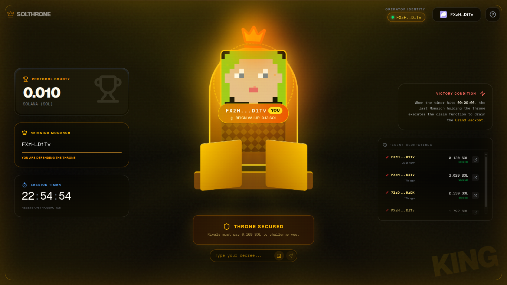
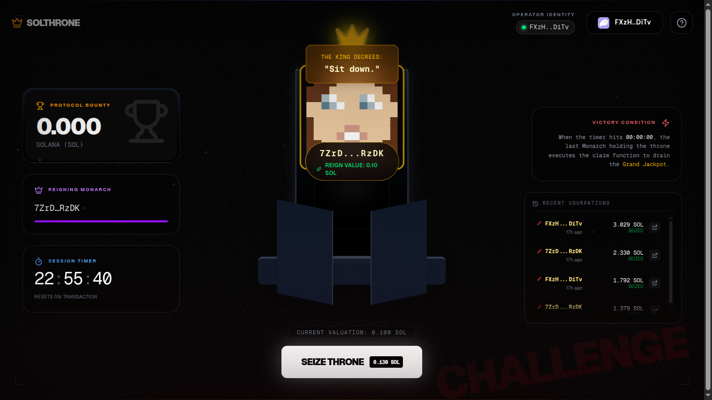

<div align="center">

# 👑 SolThrone

### *King of the Hill on Solana*

A high-stakes, blockchain-powered survival game where only the last monarch standing claims the throne—and the treasure.

[](https://nextjs.org/)
[](https://solana.com/)
[](https://www.anchor-lang.com/)
[](https://www.typescriptlang.org/)


</div>

---

## 🎮 **What is SolThrone?**

**SolThrone** is a decentralized, on-chain game of economic warfare built on Solana. Players compete to become the *Reigning Monarch* by outbidding each other in a high-stakes auction. The last player holding the throne when the timer expires wins the entire jackpot.

### **The Mechanics**
- 🏆 **Seize the Throne**: Pay 30% more than the current price to become king
- 💰 **Instant ROI**: Get 15% profit when someone usurps you
- ⏰ **Anti-Snipe Protection**: Timer extends when a bid comes in the final 5 minutes
- 🎯 **Winner Takes All**: Last monarch claims the entire jackpot when time expires
- ⚡ **Lightning Fast**: Built on Solana for sub-second transactions

---

## 📸 **Screenshots**

| **King's View (Royal Atmosphere)** | **Challenger's View (The Forge)** |
|:---:|:---:|
|  |  |

---

## ✨ **Features**

### 🎨 **Immersive UI/UX**
- Cinematic background with gradient effects and noise textures
- Real-time throne visualization with 3D animations
- Framer Motion-powered smooth transitions
- Responsive design for mobile and desktop

### 🔐 **Solana Wallet Integration**
- Support for Phantom, Solflare, and all major Solana wallets
- Secure wallet connection via `@solana/wallet-adapter`
- Real-time balance and transaction updates

### 📊 **Live Game Statistics**
- **Protocol Bounty**: Real-time jackpot tracker
- **Reigning Monarch**: Current king's wallet address
- **Session Timer**: Countdown with hours, minutes, and seconds
- **Activity Log**: Transaction history with timestamps and explorer links

### 🎯 **Smart Contract Features**
- **Anti-Snipe Mechanism**: Timer resets to 5 minutes if bid comes in late
- **Instant Payouts**: Previous king receives 115% of their bid immediately
- **Creator Fee**: 5% platform fee on every transaction
- **Jackpot Accumulation**: Remaining funds flow into the grand prize
- **Auto-Reset**: Game automatically restarts after jackpot is claimed

---

## 🏗️ **Architecture**

### **Frontend Stack**
```
Next.js 16 (App Router)
├── React 19.2
├── TypeScript
├── Tailwind CSS
├── Framer Motion (Animations)
├── Solana Wallet Adapter
└── Anchor Client
```

### **Smart Contract**
```
Anchor Framework (Rust)
├── On-Chain State Management
├── PDA (Program Derived Address) for Game State
└── Safe Math with Overflow Checks
```

### **Project Structure**
```
solthrone/
├── client/               # Next.js Frontend
│   ├── app/             # App Router pages
│   ├── components/      # React components
│   │   ├── game/       # Game-specific components
│   │   └── layout/     # Layout components (Navbar, etc.)
│   ├── hooks/          # Custom React hooks
│   ├── context/        # Wallet context provider
│   └── idl/            # Anchor IDL for contract interaction
│
└── server/              # Solana Smart Contract
    ├── programs/       # Rust program source
    ├── tests/          # Anchor tests
    └── target/         # Compiled programs
```

---

## 🚀 **Getting Started**

### **Prerequisites**
- Node.js 18+ and pnpm
- Solana CLI
- Anchor CLI (for smart contract development)
- A Solana wallet with devnet SOL


## 🎲 **How to Play**

### **Step 1: Connect Wallet**
Click the wallet button in the top-right corner and connect your Solana wallet.

### **Step 2: Initialize Game** (First Time Only)
If the game hasn't been initialized, click **"INITIALIZE PROTOCOL"** to set up the game state.

### **Step 3: Seize the Throne**
Click **"SEIZE THRONE"** and pay the required SOL to become the king. The price increases by 30% with each bid.

### **Step 4: Defend or Exit**
- **Defend**: Hold your position and pray no one outbids you
- **Exit Strategy**: Get usurped for an instant 15% ROI

### **Step 5: Claim Victory**
If you're the king when the timer hits zero, click **"CLAIM JACKPOT"** to withdraw the entire prize pool.

---


### **Profit Scenarios**

| **Scenario** | **Your Action** | **Outcome** |
|--------------|----------------|-------------|
| **Quick Exit** | Get usurped immediately | +15% ROI (instant profit) |
| **Hold & Lose** | Get usurped after holding | +15% ROI (instant profit) |
| **Win Jackpot** | Last king standing | +Entire Jackpot (potentially 100x+) |

---
## 🤝 **Contributing**

Contributions are welcome! Please follow these steps:

1. Fork the repository
2. Create a feature branch (`git checkout -b feature/amazing-feature`)
3. Commit your changes (`git commit -m 'Add amazing feature'`)
4. Push to the branch (`git push origin feature/amazing-feature`)
5. Open a Pull Request

---

## 📜 **License**

This project is licensed under the MIT License - see the [LICENSE](LICENSE) file for details.

---

## 🔗 **Links**

- **GitHub**: [ANAS727189/SolFlux](https://github.com/ANAS727189/SolThrone)

---

## ⚠️ **Disclaimer**

This is an experimental project built for educational and entertainment purposes. Smart contracts involve financial risk. Always do your own research and never invest more than you can afford to lose. This game is deployed on **Solana Devnet** for testing purposes.

---

<div align="center">

### Built with 💜 by Anas

**SolThrone** • *Where Only the Last Monarch Reigns*

</div>
